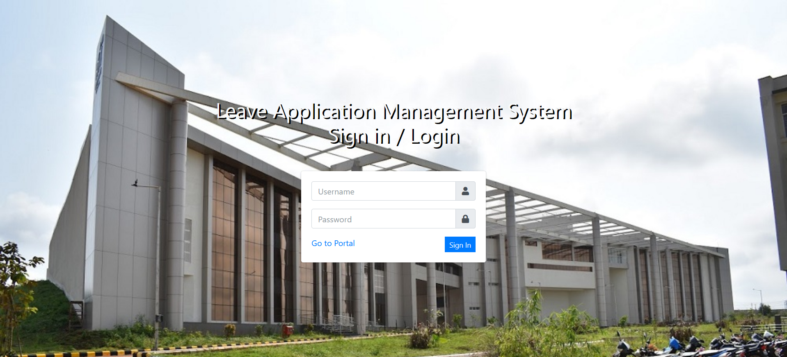
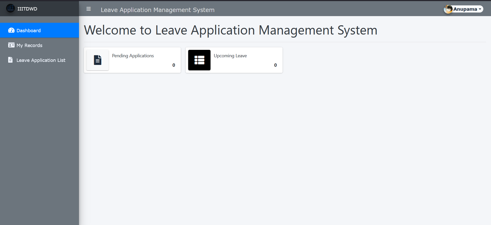
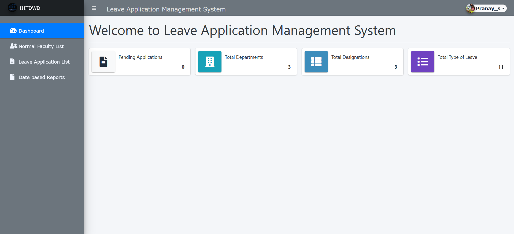
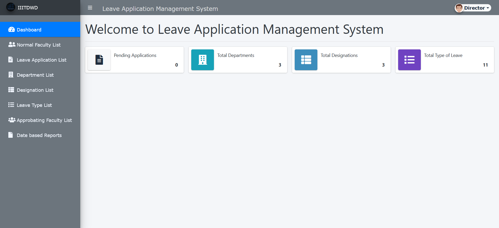

# Leave Application Management System

This is the login page for our project Leave Application Management System.
Our main idea is to provide a platform that follows the rules and regulations of any institute and design the functionalities accordingly.

*We have created 4 roles namely :*

- **Normal Faculty** - The Faculty who applies for leave and have minimal access.
- **Approbating Faculty** - Faculty who approves the leaves of normal faculty.
- **Super user** - Faculty which can access all the details of both normal faculty and approbating faculty.[Here, It is Director.]
- **Admin** - Faculty who have only view access to restricted areas and can operate on "settings" of the website.

*Credentials :*

|Credentials| Normal Faculty | Approbating Faculty | Super user | Admin |
|:---:|:---:|:---:|:---:|:---:|
|Username | anupama|pranay_s| Director| admin|
|password | 2k2201|hodcse| director123| admin123|
---
**Here are some screenshots that demonstrate the functionalities of all the users.**

*NORMAL USER :*

*SUPERIOR USER :*

*SUPER USER :*

*ADMINISTRATOR :*

